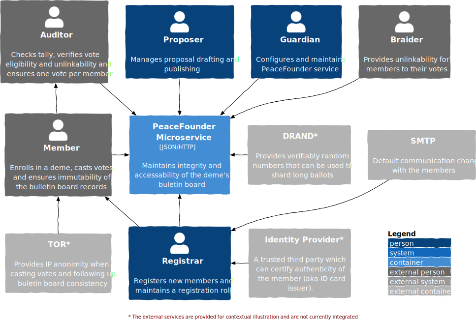
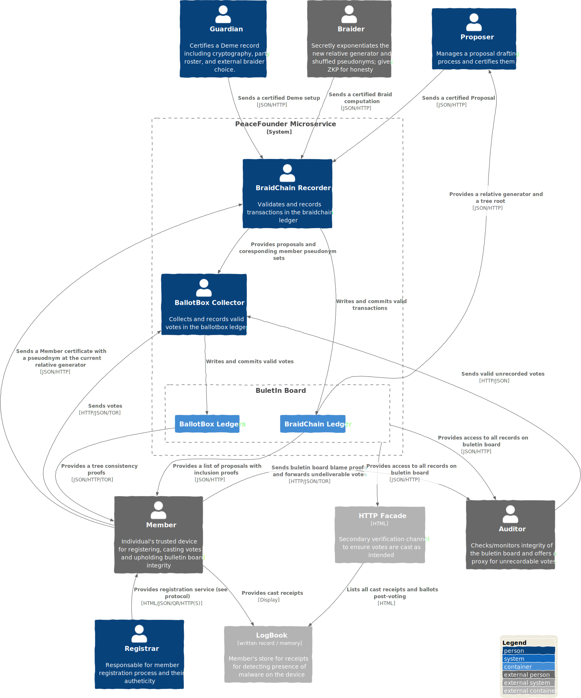

# Overview

The core primitive underlying the peacefounder system revolves around the ability to generate digital signatures using a single private key for distinct relative generators, all while maintaining the security of the key. The signatures in such cases are supplemented with a corresponding public key for a relative generator at which the signature has been issued. A relationship between these public keys can be established by showing an exponent connecting the relative generators or forming zero-knowledge proof demonstrating the equality of discrete logarithms [...]. 

The concept of unlinkability here can be harnessed to create an interconnected structure using multiple private keys resembling a knot. In this structure, input **pseudonyms**—public keys derived by exponentiating relative generators with private keys—are bound to output pseudonyms. To achieve this, a dealer exponentiates relative generators and pseudonyms with the same secret exponent and then reshuffles the resulting output pseudonym list. We shall refer to this procedure as **braiding** to distinguish mixing objectives where input retains the original form after going through a mix cascade. 

To ensure integrity in resulting braids, in particular, that braider had not replaced output pseudonyms with its own, zero-knowledge proofs can be used. This can be done by reformulating exponentiation as ElGamal re-encryption shuffle and consequent decryption as recently proposed in a novel e-voting system design [...]. The zero-knowledge proof of shuffle has been successfully made widely available for ElGamal re-encryption mixnets with Verificatum, which offers proof with relatively standard cryptographic assumptions on the difficulty of computing discrete logarithms and a decisional Diffie Hellman assumption [...]. Combined with zero knowledge proof of correct decryption [...], a braid proof can be formed, proving to everyone that computations have been performed honestly without revealing the secret exponentiation factor braider had used and can be safely forgotten afterwards. The resulting braid primitive is available in the ShuffleProofs.jl package, which also reimplements Verificatum-compatible proof of shuffle [...]. 

The braid primitive enables anonymisation to be transactional with one braider at a time, thus eliminating the need for complex coordination of parties as it is typical for many re-encryption mixnet or homomorphic-based e-voting systems [...]. In addition, it's also possible to publish this evidence on a bulletin board for everyone to verify without compromising participation privacy. The peacefounder system outlined here can be considered an implementation of the previously proposed system by R. Haeini and O. Spycer [...]. Nevertheless, PeaceFounder introduces several key features:

- A scalable bulletin board design with thin-member clients ensuring the immutability of all published records without replication;
- A registration protocol for new members that catches them up with the current relative generator;
- Mechanisms to handle uncooperative bulletin boards through auditors/proxies while preventing potential exploitation by coercers and bribers with time-restricted receipt freeness and revoting;
- A system allowing a member's device to detect private key leaks coming from spyware or bad cryptography via sequence numbers and bitmasks;
- A malware detection mechanism post-voting, where the device displayed receipt, is compared to a bulletin board while not being deceived into verifying another's voter's vote.

Furthermore, PeaceFounder showcases that a single maintainer can feasibly deploy the system. It also offers seamless integration opportunities with existing infrastructure and political environment for supporting different ways proposals are put to the ballot box, and member authenticity is verified and later audited. Additionally, the PeaceFounder showcases user experience for the voter, minimising their exposure to complex byte strings while maintaining cryptographic soundness along with other usability improvements. 

The PeaceFounder's bulletin board is a microservice that accepts transactional records and votes. The primary transactional records include member certificates issued in prospective **member** interaction with the **registrar**, braid records which recompute pseudonym member list and corresponding relative generator issued by a **braider** and proposal records announcing a vote issued by a **proposer**. The system is configured with a **guardian** issued deme record, which sets cryptographic parameters, and a rooster, which includes the proposer, registrar, and bulletin board authority identities. 

The peacefounder bulletin board microservice, proposer, and registrar microservices are internal and can be managed or delegated by a single-person **guardian**. This separation accommodates customisation for varied political consensus, criteria for proposal submissions to the ballot box, choice of identity provider, and methods for disclosing registrar information to auditors to verify the legitimacy of voting members. To make testing and deployment easier for new organisations, a bundle that includes a registrar, proposer and bulletin board will be available and deployable on a preferred server of choice and will offer web access for a guardian with sane defaults and configuration options.

Member's client devices actively monitor the bulletin board, ensuring the immutability of records by tracking bulletin board commitments. This method of oversight is scalable, as members only request Merkle tree consistency proofs, eliminating the need to replicate the actual bulletin board records. These proofs guarantee the protection of their votes and others, assuring that modifications to records are prevented when fresh entries are appended to the bulletin board. This streamlined approach enables prompt identification of bulletin board dishonesty, whether through removing or altering records or the malicious creation of a counterfeit ledger to exclude undesirable votes from the official tally.

Integral to establishing trust a pivotal role is the presence of an **auditor**. The auditor represents an abstract entity that represents members and is vital for resolving conflicts. Member client devices create local proofs for altered or removed records or the presence of a counterfeit ledger, which are then sent to the auditor. Moreover, if votes aren't delivered, the auditor can act as a proxy, offering evidence that the bulletin board deliberately omitted specific votes. The auditor also ensures the integrity of the bulletin board's records, confirming each vote's eligibility and unlinkability and ensuring one vote per member.

It is noteworthy that the auditor doesn't need a formal association with the guardian to verify the integrity of a resulting tally, as all relevant data is on the public bulletin board (except for the registration roll). This autonomy allows members the freedom to select their trusted auditors. If there are unresolved disputes with the bulletin board, members can even take on the auditor role and, if necessary, seek to replace the guardian. The transparency of the system further allows auditors to cross-check each other's findings, promoting accuracy and preventing the spread of false claims.

The auditor plays a key role in assessing the registrar to confirm the authenticity of its members. The registrar maintains a registration roll, serving as evidence of member authenticity. Verification can be as simple as a trusted third party's digital signature on a document that includes the organisation's UUID and the index where a member's certificate is recorded. If a third-party verification system isn't available, a photo or video of an individual displaying a page with the organisation's title and index might suffice. Regardless of the method, a recommended approach is to provide the auditor with a random subset of members—ensuring randomness, for instance, by using the DRAND service to avoid data aggregation—for thorough examination.

Another pillar that is necessary for ensuring democratic elections is to prevent coercion and vote buying. One significant risk to the PeaceFounder system arises when a vote buyer impersonates an auditor and offers a proxy to channel their votes through them. To counter this threat, each has the option to revote an unlimited number of times. During the voting process, the bulletin board hides the actual votes, displaying only their hashes, to maintain receipt freeness and ensure vote fairness. This method stops vote buyers from being certain that their procured votes will count in the final results. Consequently, bribers can only return bribes when votes become publicly visible on the bulletin board. This arrangement erodes trust in the briber since they can't guarantee their reliability, making members less likely to engage in such dubious transactions.

Another pillar that is necessary for ensuring democratic elections is to prevent coercion and vote buying. The most dreadful threat to the PeaceFounder system is for a vote buyer to impersonate an auditor and ask willing members to proxy votes through them. To counter this risk during voting, the bulletin board hides the actual votes, showing only their hashes, and gives voters an option to revote, ensuring both receipt freeness and vote fairness. A sequence number along the vote ensures that only the latest cast vote on the device matters. 

This method stops vote buyers from being certain that their procured votes will count in the final results. Consequently, bribers can only return bribes when votes become publicly visible on the bulletin board. This arrangement erodes trust in the briber since they can't guarantee their reliability, making members less likely to engage in such dubious transactions. This prevents coercers and vote buyers from being certain that the votes they've acquired will count in the final results. Hence, they can only refund bribes once the real votes are publicly displayed on the bulletin board. This system challenges the reliability of bribers, as they cannot guarantee their credibility to members, thereby reducing members' inclination to engage in such activities due to the lack of straightforward transactional assurance.

A secondary concern is the potential for a coercer to demand proof of how an individual voted on their device. To combat this, the actual choice isn't displayed but only a receipt. However, this receipt can be linked to the specific vote on the bulletin board. If coercion becomes a significant threat, the receipt can be made visible for only a short duration, such as 30 minutes after casting a vote. During this window, members can manually record their details in a logbook. While this approach may reduce user-friendliness, it still serves as a robust deterrent against malware attempting to cast votes on behalf of the voter.

The last piece of the puzzle is malware and spyware resistance. An adversary could issue votes without compromising the voter's device in case of key leakage. To counter this, every vote includes a sequence number, which records evidence on the bulletin board when a vote is cast from the voter's device. Moreover, if a vote with a sequence number of one is already on the ledger, any subsequent vote with the same number will be overridden by the first. This mechanism prevents malware from secretly replacing inactive voter's choices. 

After voting concludes and the results are published, each voter receives a bitmask of the votes included in the final tally, along with consistency proofs. Given that this approach is scalable (e.g., 1kB can handle 8192 votes, and bit compression can further reduce size), voters can compare this bitmask with the index from their most recent vote receipt. This allows them to detect any malware activity and display an alert to the voter.

To ensure the integrity of the voting process, it's crucial that the voter's device remains trustworthy. With the presence of malware, there's a risk that the device could falsely reassure the user that their vote has been cast correctly. To counter this threat, after a vote is submitted, the voter receives a receipt containing a *timestamp* of the vote's recording, the *pseudonym* under which it was cast, and the *index* where the vote resides on the ledger. Once voting concludes and all votes are disclosed on the bulletin board, the voter can cross-reference their receipt with the bulletin board, verifying the vote at the indicated *index* aligns with their choice and matches the *timestamp* when the vote was cast, as well as checking that it was included in the final tally. By maintaining a written record, voters can ensure the accuracy of their vote, safeguarding against malware alterations, unauthorised revoting, or any attempts to redirect multiple voters to a singular vote. 

However, it's important to acknowledge that voters can only detect malware interference post-vote when comparing their receipt to the bulletin board. Additionally, a voter cannot provide evidence to others that their vote was compromised by malware, which means these instances aren't audited within the PeaceFounder system. As a result, members are encouraged and responsible to utilise more secure devices less susceptible to malware attacks. For more advanced threats, like a briber mandating malware installation for monitoring or extracting the master key, the use of tamper-resistant hardware becomes essential – an extension larger organisations or states might consider.

### Prior Art

E2E (end-to-end) verifiable voting systems have become the gold standard due to their universal and individual verifiability. Leading designs, like those in Estonia [...] and Helios [...], utilize the re-encryption mix net wheras others use homomorphic counting procedures coupled with a threshold decryption [...]. Due to the need to encode ballot selection in a group element only restricted number of ballot types can be supported and face challenge for instance for cardinal and budget planning ballots. Another major hurdle in these systems is the multiparty protocol ceremony required for initiating the threshold decryption key and performing decryption at the end of the vote. The voter's anonimity demands independence of the invoved parties which introduces a risk for sabotage where ellection results are undecrypted and unanounced.

An alternative approach is to anonmize voter's credentials instead of the votes. The idea has been explored with blind signature schemes, but auditing the authority's issuance of voting keys and detecting key leaks remains unresolved [...]. A subsequent method, proposed by Haeiny&Spencer [...] leverages ElGamal reencryption to verifiably exponentiate voter's public keys in tandem with a generator using zero knowledge proofs. Moreover, they present a design for a voting system which serves as a foundation for peacefounder. Nevertheless, PeaceFounder introduces several key features:

- A scalable bulletin board design with thin-member clients ensuring the immutability of all published records without replication;
- A registration protocol for new members that catches them up with the current relative generator;
- Mechanisms to handle uncooperative bulletin boards through auditors/proxies while preventing potential exploitation by coercers and bribers with time-restricted receipt freeness and revoting;
- A system allowing a member's device to detect private key leaks coming from spyware or bad cryptography via sequence numbers and bitmasks;
- A malware detection mechanism post-voting, where the device displayed receipt, is compared to a bulletin board while not being deceived into verifying another's voter's vote.

Furthermore, PeaceFounder showcases that a single maintainer can feasibly deploy the system. It also offers seamless integration opportunities with existing infrastructure and political environment for supporting different ways proposals are put to the ballot box, and member authenticity is verified and later audited. Additionally, the PeaceFounder showcases user experience for the voter, minimising their exposure to complex byte strings while maintaining cryptographic soundness along with other usability improvements. 

## Implementation details and responsibilities

In order to illustrate the responsibilities of different entities and the structure of the communication channels, we've provided a detailed diagram. In this representation, arrows indicate which entity holds responsibility over specific resources. The primary mode of communication is facilitated through JSON within an HTTP request/reply. The JSON is also chosen as a canonical bytestring format for data signing, which is selected over the ASN1 DER format due to development resource constraints.

The architecture bifurcates the bulletin board into two distinct ledgers: the braidchain and the ballot boxes. This differentiation arises from the disparate pacing and metadata requirements of records. Additionally, casting votes remains inconsequential to the braidchain's state, justifying the ledger division.

Authorized entities, namely the braidchain **recorder** and the ballot box **collector**, as specified in the guardian issued DemeSpec record, oversee each ledger. These controllers uphold the integrity of newly added records, ensuring their coherence with the existing state. For instance, votes must adhere to specified time window and need to be appropriately signed with member pseudonyms. Braidchain transactions demand a more intricate state management, which will be described subsequently. 

In the diagram, arrows necessitating anonymous channels are designated with a TOR label, originating from the member. This is a countermeasure against potential adversaries attempting to link votes to members via IP addresses. Although alternative network anonymizing solutions exist TOR is most prominent and together with recent release of Arti project for Rust makes it an ideal for client side applications [...].

Members can view the bulletin board records through the HTTP Facade, which displays them in a browser-friendly HTML format. This provides a secondary channel to verify that votes are both cast as intended and accurately counted. A pure JavaScript based HTTP facace is possible which can be hosted on a static websites, simplfiyng deplyment. 

It's imperative to recognize the absence of TLS in all communications. This choice stems from the fact that data from buletin board is supported with signature on Merkle tree root, rendering requests tamper-proof. Moreover, using TLS session resumption for anonymous interactions between members and the bulletin board would unintentionally make the system vulnerable to DDOS attacks during the key establishment phase. Furthermore eliminating the need for certificate issuance and management streamlines system maintenance and deployment, enhancing usability.

## Extensions

In order to avoid overcommitment the peacefounder project currently focuses on smaller scale organizations. This is  implies that a single developer must be able to maintain the system as well ass that coercion/bribery is not at the uttermost importance and that electoral roll is not necessary to satisfy requirements of a law. Thus thoose features currently are not integrated in the current design and can be considered in a seperatelly as extensions of the system. 

### Electoral Roll

Some communities may wish to nudge their members to vote, providing benefits for those who have already cast a vote or punishing those who ignore democratic decision-making. In ordinary e-voting systems that can be easily achieved through a voter’s registry. However, this is not possible for PeaceFounder because voters are completely anonymous when they vote.

One way to address this issue is with a blind signature scheme. The voter takes his identity pseudonym, blinds it with a random factor and includes that in the vote when sent to the ballot box. The collector checks that the vote is valid and, if so, signs the blinded group element at the time when the vote is recorded in the ledger. The previous blind signature is used if the voter has already cast a ballot.

The voter then receives an acknowledgement that the vote is permanently recorded in the chain together with the blind signature and timestamp. The voter unblinds the blind signature with its blinding factor and obtains a signature on his identity pseudonym as proof of participation. That can then be safely shown publicly for anyone who wants to see that the person has voted without being linked to the cast vote.

### Selection assymetric encryption

In order to maintain the impartiality of auditors/monitors with regard to votes they oversee and further deter potential bribery attempts, an asymmetric encryption method for vote selection is advisable. Under this protocol, the voter's device first encrypts a symmetric key asymmetrically and then proceeds with encryption the vote selection using this symmetric key. Both the encrypted key and the encrypted selection are included in the vote, which is then signed using a pseudonym. Upon receiving the vote, after authenticating its signature, the system decrypts the symmetric key followed by the vote selection. To ensure the decryption's integrity, a zero-knowledge proof is provided and subsequently published alongside the vote on the bulletin board.

### Coerced vote tagging

A threat where coercers forcibly dictate voter's choice, while subsequently confiscating their devices, is a pressing concern that extends beyond the PeaceFounder system. A common solution to such problem is equping voters with a choice to create a seconduary PIN code which works excatly as the primary PIN code except for the fact that the votes are tagged to be coerced. 

To safeguard against coercers potentially discerning this distinction by using a proxy vote submission method, the coercion tag can be asymmetrically encrypted as a group element prior to their transmission to the ballotbox collector. Upon receipt, the collector would record and then decrypt coercion tag for votes, which can then be publicly discounted. A zero-knowledge proof of decryption would ensure the collector's integrity published together with a vote on the buletin board. 

Votes are disclosed at the conclusion of the process, indicating any tags applied. By lengthening the gap between the tally announcement and the release of the votes, we can diminish the impact of coercive threats and deter unscrupulous voters from awaiting compensation, hinging on the assumption of the briber's credibility. Technically, this mechanism ensures receipt freeness until they appear on the ballotbox ledger.

This strategy is contingent on the premise that no adversarial entity has infiltrated the collector system. To mitigate such risks, the deployment of multiple collectors, to which voters are randomly pre-assigned, is advised. This introduces a level of inter-collector accountability, as aggregated results should align. Importantly, while receipt freeness is limited, it retains full transparency: all parties can validate the tally's accuracy, verify every vote's elligiability and unlinkability as well as validity of coercion tag. 

### Early leaked private key detection

In a situation where adversary have acquired a private key of the member they can form valid votes which can be included in the buletin board. To detect that a bitmask is included in the ballotbox commit which voter retrieves together with conssitency proofs. That allows to detect whether tallied vote have been cast from the device as the device can look into bitmask of votes inlcuded in the tally after the vote. However in situations where member votes after adversary the buletin board could inform about the fact in the receipt.

A problem lies in the fact that showing on receipt whether vote is a final submission consiedred for inclusion in the tally can impede the voter's ability to revote in case the coercer/briber waits until the last minute before submitting their acquired vote. This circumvents a measure where publishing votes is delayed for exteneded time after the tally is published for erroding trust in bribers and delaying punishment from coercers.  Therefore the response status needs to be assymetrically encrypted. 

To make matters simple the status code can be encrypted as a group element which then can then be decrypted on the voters device. In the case the submitted vote is not final the collector encrypts a group element representing status adressed to the pseudonym which cast the vote. The device receives the receipt and as it only has the private key the status code can be shown allowing member to see early on whether vote have been already cast before with provided sequence number and superseed it with possible recasting. 

### Sharded Ballots

In the context of democratic processes, it's conceivable that voters may be presented with an extensive list of ballot questions to express their opinions. However, as evident in comprehensive surveys, there is a noticeable decline in response rates as the number of questions escalates. Further complicating matters is the phenomenon known as the 'voter's paradox,' wherein the impact of a singular vote diminishes in larger elections. Both of theese challenges can be potentially addressed with sharding lengthy ballots among the entire voter base. 

In the PeaceFounder system sharding is trivial due to votes being cast pseudonomously. The initial step in the sharding involves determining all feasible divisions of the ballot and methodically enumerating them. Subsequently, these shards are allocated to pseudonyms, achieved by systematically sorting and matching them in sequence.

Nevertheless, a pronounced security concern emerges. If an adversary assumes control over the proposer and possesses knowledge of a select group of pseudonym owners and their inclinations, they have the capability to manipulate the election outcome by tailoring the proposal and shards. Specifically, critical questions can be allocated to a limited cohort, skewing results in their favor.

To counteract this vulnerability, it's imperative for the proposer to commit to both the ballot and its associated shards, followed by a lottery to randomize the pseudonym list. Leveraging a DRAND service, which collaborates with multiple entities to execute threshold decryption, ensures the generation of predetermined, incorruptible random numbers [...]. These numbers subsequently serve as a salt for hashing pseudonyms, which are then sorted and allocated to shards accordingly. A critical aspect of this method is making sure the proposal is commited before the lottery result is anounced, to prevent adversary taking advantage for waiting a favourable lottery outcome. This necessitates the involvement of auditors/monitors to externally timestamp the braidchain ledger commitments.
